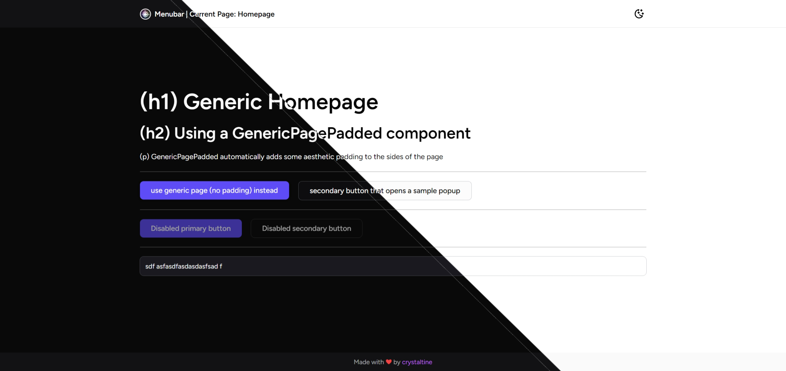

# crystaltine's React + Vite Template
Basic repo containing prebuilt custom styles and components for my React + Vite (Typescript) web projects
since i often find myself making the same things over and over again.

### Preview (5305506)


### Quick Usage
```
git clone https://github.com/crystaltine/template-react-vite project-name
cd project-name
npm i
npm run dev
```

Code isn't the most optimized. This is
mainly for my personal use but there are no
restrictions on your own use of this.